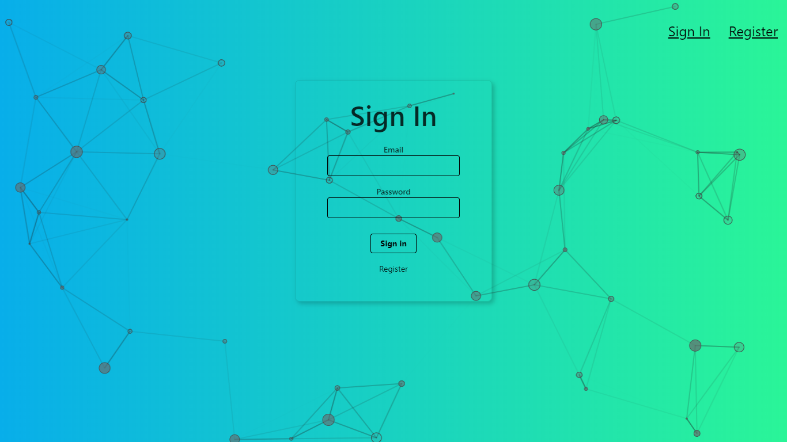
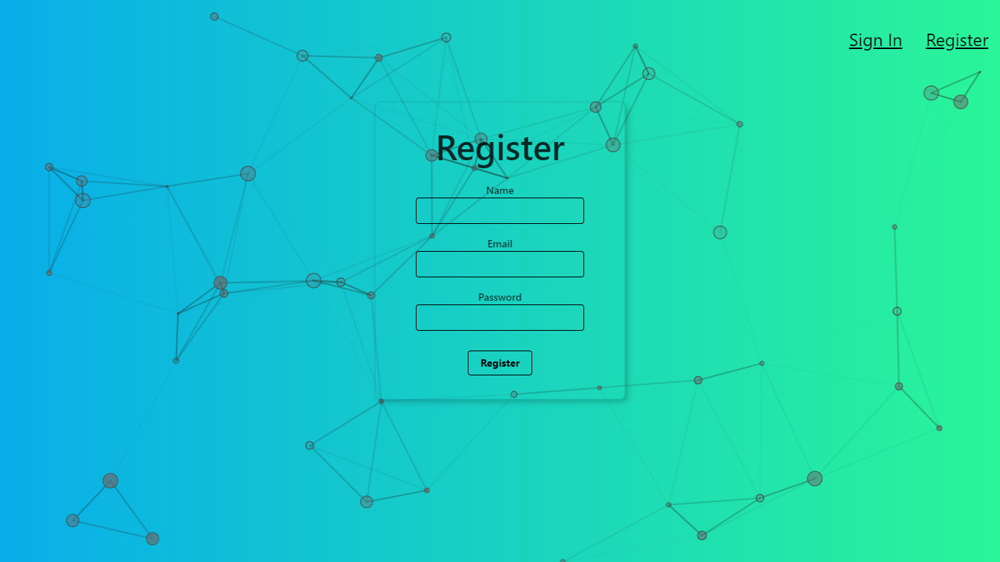
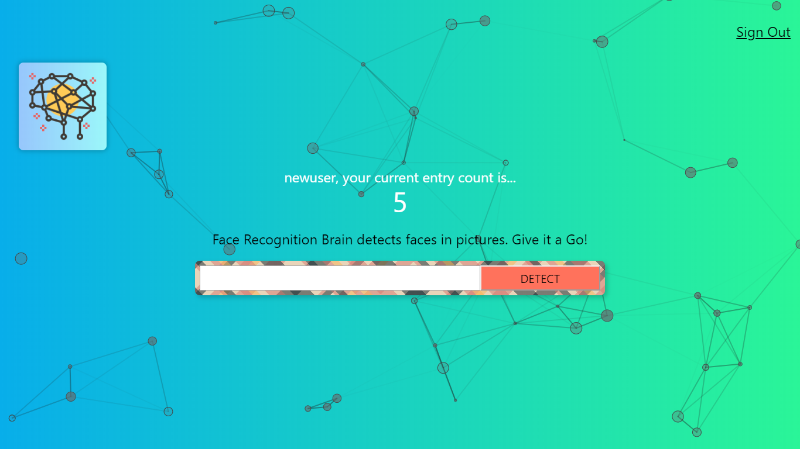
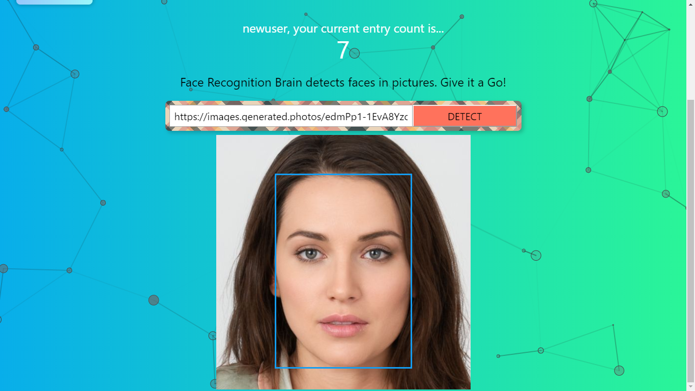

# Face Recognition Brain
Image Face Recognition application - Detect Faces in the given Image using machine learning API. 


## [Live Preview](https://smart-facerecognitionbrain.herokuapp.com/)
#### Sign In

#### Register

#### Search Bar

#### Face Detection



## Contributing
Pull requests are welcome. Feel free to `fork` this repo.


## Back-End -- Server__

[Change localhost](https://stackoverflow.com/questions/40714583/how-to-specify-a-port-to-run-a-create-react-app-based-project)

If you don't want set environment variable, other option - modify scripts part of package.json from: `"start": "react-scripts start"`  

or (maybe) more general solution by to:`"start": "export PORT=3006 react-scripts start"`  

Windows solution to:`"start": "set PORT=3006 && react-scripts start"`

**Front-end:**

```Javascript
fetch('http://localhost:3000/image', {
	method: 'put',
	headers: {'Content-Type': 'application/json'},
	body: JSON.stringify({
		id: this.state.user.id
	})
})
.then(response => response.json())
.then(count => {
	this.setState(Object.assign(this.state.user, { entries:count}))
})
```

**Back-end:**

```Javascript
const cors = require('cors')
app.use(cors());
```